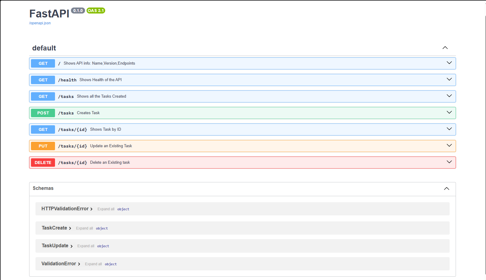

# Task API

A simple in-memory CRUD API for managing tasks built with FastAPI and Python.
Data lives in memory — it resets on every server restart. No database yet.

## How to Run

uv run uvicorn main:app --reload

Server starts at http://localhost:8000
Swagger UI at http://localhost:8000/docs

## Endpoints

| Method | Path | Description | Success Code | Error Codes |
|--------|------|-------------|--------------|-------------|
| GET | / | Returns API name, version, endpoints | 200 | - |
| GET | /health | Returns API health status | 200 | - |
| GET | /tasks | Returns all tasks | 200 | - |
| GET | /tasks/{id} | Returns a single task by ID | 200 | 404 |
| POST | /tasks | Creates a new task | 201 | 400 |
| PUT | /tasks/{id} | Updates title and/or done status | 200 | 400, 404 |
| DELETE | /tasks/{id} | Deletes a task | 204 | 404 |

## Validation Rules

- POST and PUT reject empty or whitespace-only titles with 400
- All errors return JSON: `{"detail": "message"}`

## Example Request

curl -i -X POST http://localhost:8000/tasks \
  -H "Content-Type: application/json" \
  -d '{"title": "Buy milk"}'

HTTP/1.1 201 Created
{"id": 4, "title": "Buy milk", "done": false}

## Swagger UI

## Tech Stack

- Python 3.10+
- FastAPI
- Uvicorn
- Pydantic v2
- uv